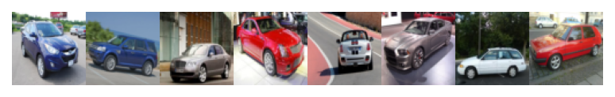
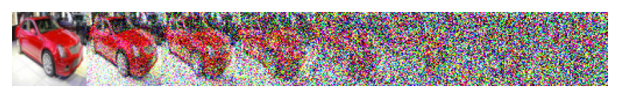
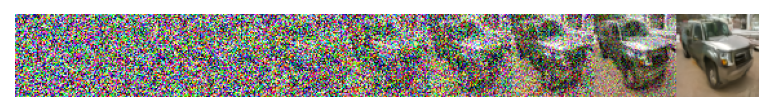
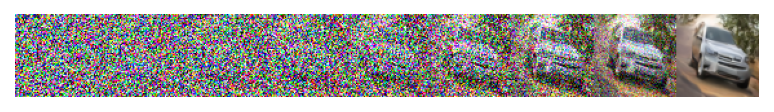
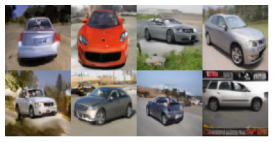

# Training a Denoising Diffusion Probabilistic Model from Scratch

This mini-project implements and trains a [**Denoising Diffusion Probabilistic Model (Ho et al., 2020)**](https://arxiv.org/abs/2006.11239).

For a technical introduction in image generation and diffusers, check my [blog post on that topic](https://mikelsagardia.io).

The folder contains two files:

- The module [`unet.py`](./unet.py), taken from [labmlai/annotated_deep_learning_paper_implementations](https://github.com/labmlai/annotated_deep_learning_paper_implementations). This module defines the *U-Net* model which is able to predict the noise of an image, after trained.
- The notebook [`ddpm.ipynb`](./ddpm.ipynb), where the entire dataset and model preparation, as well as the training, are implemented. Some parts were modified from the course material of the [Udacity Generative AI Nanodegree](https://www.udacity.com/course/generative-ai--nd608).

The dataset used in the example is the [Stanford Cars Dataset](https://www.kaggle.com/datasets/eduardo4jesus/stanford-cars-dataset). It contains 16,185 color images categorized in 196 classes, which are resized to `64x64` .

The formulas of the DDPM paper, as well as the forward and reverse diffusion algorithms, are implemented in a modular fashion and with plenty of comments and references.

Exemplarily, the function `visualize_forward_diffusion()` produces these noisy images on a single car sample:

<small style="color:grey">
A total of <code>T=512</code> steps are taken to iterative add noise to a sample and train the <i>U-Net</i> to predict the added noise map. The figure shows 7 equally spaced stages of those steps.
</small>

I trained a *U-Net* model of 54 million parameters using the following configuration:

- Device: [NVIDIA RTX 3060](https://mikelsagardia.io/blog/mac-os-ubuntu-nvidia-egpu.html)
- 300 epochs (10 warm-up)
- A base learning rate of `0.0001` and cosine scheduling
- Batch size of 64
- `T=512` diffusion steps
- A linearly increased noise variance $\beta$ in the range of `[0.0001, 0.02]`

The training process, run by `train()`, produces an iterative denoised image strip every epoch which is generated from the same fixed noise map. In the following, the image strips of epochs 1, 5, 10, 100, 200 and 300 are shown.

<small style="color:grey">
Inference or reverse diffusion during training; the performance for the same noise input is shown for epochs 1, 5, 10, 100, 200 and 300 (last epoch).
A total of <code>T=512</code> steps are taken to iterative remove noise. The figures show 9 equally spaced stages of those steps at each epoch.
</small>

The final model is able to generate new samples as the following:

Mikel Sagardia, 2025.  
No guarantees.
