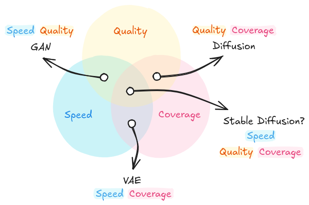

# Image Generation with Diffusion

<!--
# Log in/out to Docker Hub
docker logout
docker login

# Pull the official image (first time)
docker pull excalidraw/excalidraw

# Start app
docker run --rm -dit --name excalidraw -p 5000:80 excalidraw/excalidraw:latest
# Open browser at http://localhost:5000

# Stop
docker stop excalidraw
docker rm excalidraw
docker ps

---

Blog Post 1  
Title: An Introduction to Image Generation with Diffusion Models (1/2)  
Subtitle: A Conceptual Guide for Developers & ML Practitioners

Blog Post 2  
Title: An Introduction to Image Generation with Diffusion Models (2/2)  
Subtitle: Hands-On Examples with Hugging Face

-->

<strong>
This is the first post of a series of two.
You can find the <a href="https://mikelsagardia.io/posts/">second part here</a>.
Also, you can find the accompanying code <a href="https://github.com/mxagar/diffusion-examples/ddpm">this GitHub repository</a>.
</strong>

I still find it fascinating that machine learning models are able to learn from examples, even after working with them for more than a decade.  
But what truly feels like magic to me are image and video generation models.

Driven by that fascination, I decided to write a short series of posts explaining how these models work, both in theory and in practice.

In **this first post**, you will:

- Learn how image *generation* differs from image *discrimination* (e.g., image classification).
- Understand how *Diffusion* models compare to *Generative Adversarial Networks* (GANs) and *Variational Autoencoders* (VAEs).
- Learn how *Denoising Diffusion Probabilistic Models* (DDPMs) work at both conceptual and mathematical levels.
- See a full, minimal PyTorch implementation of a DDPM that generates car images using a consumer-grade GPU.

In the [**second and final post**](https://mikelsagardia.io/posts/), I'll move on to practical examples using the Hugging Face libraries.

Let’s get started!

── ◆ ──

In machine learning, any sample or data instance can be represented as feature vector $x$.
These features could be the RGB values of an image's pixels or the words (tokens) of a text represented as vocabulary indices.
In deep learning, these vectors are often transformed into *embeddings* or *latent* vectors, which are compressed representations that still retain differentiable semantic meaning.

<small style="color:grey">Any sample or data point of any modality can be represented as an <i>n</i>-dimensional vector <i>x</i> in machine learning; in the figure, images and words (tokens) are represented as 2D vector embeddings. These embeddings contain conceptual information in a compressed form. When semantics and/or similarities between samples are captured, algebraic operations can be used with the vectors, resulting in coherent, logical outputs. Image by the author.
</small>

Up until recently, mainly **discriminative models** have been used, which predict properties of those embeddings.
These models are trained with annotated data, for instance class labels: $x$ belongs to class $y = $ *cat* or *dog*.
The model then learns decision boundaries that allow it to predict the class of new, unseen samples.
Mathematically, we can represent that as $y = f(x)$, or better as $p(y|x)$,
i.e., the probability $p$ of each class $y$ given the instance/sample $x$.

On the other hand, in the past years, **generative models** have gained popularity.
These models do not explicitly capture decision boundaries; instead, they learn the probability distribution of the data.
As a result, they can sample from these distributions and generate new, unseen examples.
Following the same mathematical notation, we can say that the models learn $p(x)$ or $p(x, y)$, if the classes are considered.

<small style="color:grey">A dataset of 2D samples $x$ (i.e., 2 features) used to fit a discriminative and a generative model.
Discriminative models learn decision boundaries and are able to predict the class $y$ of new, unseen instance.
Generative models learn the data distribution $p(x)$ and are able to sample new unseen instances.
Image by the author.
</small>

In terms of *ease of control*, generative models can be of two main types:

- *Unconditional*, $p(x)$: These models learn the data distribution $p(x)$ and blindly create samples from it, without much control. You can check [these artificial faces](https://thispersondoesnotexist.com/), as an example.
- *Conditional*, $p(x|\textrm{condition})$: They generate new samples conditioned on an input we provide, e.g., a class, a text prompt or an image.
In the realm of the text modality, probably the most well-known generative model is OpenAI's [(Chat)GPT](https://openai.com/index/chatgpt/), which is able to produce words (tokens), and subsequently conversations, conditioned by a prompt or user instruction.
When it comes to the modality of images, it's difficult to point to a single winner, but common models are
[Dall-E](https://openai.com/index/dall-e-3/), [Midjourney](https://www.midjourney.com/), or [Stable Diffusion](https://en.wikipedia.org/wiki/Stable_Diffusion) &mdash; all of them are `text-to-image` conditional models.

In terms of the *modalities* they can work with, generative models can be:

- *Uni-modal*: These models can handle/produce samples of a single modality, e.g., text or images.
- *Multi-modal*: They are able to work with instances of different modalities simultaneously.
They can achieve that by creating a common *latent space* for all modalities, or mappings between them.
Latent spaces are compressed vector spaces that capture the semantics of the vectors that form them.
As a result, given a text-image multimodal model, we can ask questions about the content of an image.
Notable examples are [GPT4-Vision](https://openai.com/research/gpt-4v-system-card) and [LLaVA](https://huggingface.co/spaces/badayvedat/LLaVA)

> Discriminative models learn to predict specific properties of a data sample (e.g., a class or a value), whereas generative models learn the data distribution and are able to sample it.
> Additionally, this sampling can often be conditioned by a prompt.

## Why Diffusion Replaced GANs for Image Generation

There are three main families of generative approaches for image generation:

- Variational Autoencoders (VAEs)
- Generative Adversarial Networks (GANs)
- Denoising Diffusion Probabilistic Models (Diffusers)

[**Autoencoders**](https://en.wikipedia.org/wiki/Autoencoder) are architectures that compress the input $x$ into a lower-dimensional latent vector $z$ and then they expand it again to try to recreate $x$. The compression side is called *encoder*, the middle layer which produces the latent vector is the *bottleneck*, and the expansion side is named the *decoder*. As mentioned, the final output $x'$ tries to approximate $x$ as closely as possible; the gradient of the reconstruction error is used to update the weights of all layers. Many types of layers and configurations can be used for the encoder & decoder parts; e.g., with images often [convolutional layers](https://en.wikipedia.org/wiki/Convolutional_layer), [pooling](https://en.wikipedia.org/wiki/Convolutional_neural_network), [dropout](https://arxiv.org/abs/1207.0580), and [batch normalization](https://en.wikipedia.org/wiki/Normalization_(machine_learning)) are used to compress the image, whereas the expansion usually is implemented with [transpose convolutions](https://d2l.ai/chapter_computer-vision/transposed-conv.html).

[**Variational Autoencoders (VAEs)**](https://arxiv.org/abs/1312.6114) are autoencoders in which the elements of the latent $z$ vector are Gaussian distributions, i.e., for each latent element, they produce a mean and a variance, and then a value is sampled from that element distribution to produce the latent values. The practical effect is that VAEs produce latent spaces in which interpolation results in much smaller discontinuities than in non-variational autoencoders.

VAEs have been typically implemented for compression, denoising and anomaly detection; even though they can generate new samples using only their decoder, they usually produce less realistic results. However, they are fundamental to understand generative models, since they intuitively introduce many of the concepts later revisited by subsequent approaches. If you'd like to know nore practical details, you can have a look at [these examples](https://github.com/mxagar/generative_ai_book/tree/main/notebooks/03_vae).

[**Generative Adversarial Networks (GANs)**](https://arxiv.org/abs/1406.2661) were presented by Goodfellow et al. in 2014 and they represented a significant advancement in realistic image generation. They have two components: a *generator* (decoder-like) and a *discriminator* (encoder-like), but they are arranged and trained differently, as shown in the figure below.

The *generator* $G$ tries to generate realistic images as if they belonged to the real data distribution, starting with latent vector $z$ expanded from a noise seed. On the other hand, the *discriminator* $D$ tries to determine whether an image $x$ is real or fake (i.e., generated: $x' = G(z)$). Usually, $D$ and $G$ have mirrored architectures and their layers are equivalent to the ones used in VAEs.

The training phase looks as follows:

- First, $D$ is trained: we create batches of real images $x$ and batches of fake images $x' = G(z)$, pass them to the discriminator $D$ (i.e., we get $D(x), D(G(z))$), and compute the error with respect to the correct labels. That error is backpropagated to update only the weights of $D$.
- Second, $G$ is trained: we create new fake images with the generator $G$ and pass them to the discriminator $D$. The prediction error is backpropagated to update only the weights of $G$.
- Both steps are alternated for several iterations, until the error metrics no longer improve.

Once the model is trained, the inference is done with the generator $G$ alone.

GANs are notoriously difficult to train, [due to several factors](https://github.com/soumith/ganhacks) that are out of the scope of this blog post. Fortunately, [guidelines](https://arxiv.org/abs/1606.03498) which aid the training process have been proposed. Also, method improvements have been presented, such as the [Wasserstein GAN with Gradient Penalty](https://arxiv.org/abs/1704.00028), which alleviates the major training difficulties, and [conditional GANs](https://arxiv.org/abs/1411.1784), which provide control to the user during generation (e.g., create male or female faces).

<small style="color:grey">Variational Autoencoders (VAEs, left) and Generative Adversarial Networks (GANs, right) were the most popular generative models up until the advent of Diffusers in the past years. VAEs learn to compress and decompress inputs with an *encoder-decoder* architecture which produces a *latent* space with the compressed samples. GANs learn to produce realistic samples adversarially: they generate fake samples (with the *generator*) and try to fool a binary classifier (the *discriminator*) which needs to differentiate between real and fake samples.
</small>

Finally, we arrive at the [**Denoising Diffusion Probabilistic Models (Ho et al., 2020)**](https://arxiv.org/abs/2006.11239), presented by Ho et al. in 2020.
In just a few years, they have outperformed GANs for image generation and have become the standard method for the task. The core idea is that we train a model which takes

- a noisy image $x_t$ (in the beginning it is a pure random noise map)
- and an associated noise variance $\beta_t$ (in the beginning it will be a high variance value)

and it predicts the noise map $\epsilon_t$ overlaid on the image, so that we can subtract it from the noisy image and progressively recover a clean sample $x_0$.
The process is performed in small, gradual steps, and following a noise rate schedule which decreases the value of $\beta_t$.

As we can see in the figure below, two iterative phases are distinguished, which consist each of them in $T$ steps:

1. **Forward diffusion, used during training** &mdash; Starting with a real clean image $x_0$, we add a noise map $\epsilon$ to it, generated from a variance value $\beta$. Then, we pass the noisy image through a *U-Net* model, which should predict the added noise map $\epsilon$. The error is backpropagated to update the weights. The image at step $t$ contains not only the noise added in the previous step, but also the noise accumulated from prior steps. The forward process is done gradually in around $T = 1000$ steps. Early DDPMs used linear schedules, while cosine schedules later became standard due to improved stability.
2. **Reverse diffusion, used during inference** &mdash; We perform the inference starting with a pure, random noise map. In each step, we pass the noisy image through the *U-Net* to predict the step noise map $\epsilon_t$, subtract it from the image $x_t$ and obtain the next, less noisy image $x_{t-1}$. The process is repeated for around $T \in [20,100]$ steps, until we get a clear new image $x_0$.

<small style="color:grey">In denoising diffusion models a *U-Net* encoder-decoder model is trained to predict the noise in an image. To that end, during training (forward diffusion), noise is gradually added to an image and we query the model to predict the noise map. During inference (reverse diffusion), we start with a pure noise map and query the model to remove the noise step by step &mdash; until we get a clean new image!
</small>

── ◆ ──

So which of these approaches should we use?

To answer that question, we need to consider that generative models are usually evaluated in terms of [three competing properties, which lead to a so-called generative learning trilemma (Xiao et al., 2022)](https://arxiv.org/pdf/2112.07804):

- **Quality**: if the distributions of the generated images and real images are close, the quality is considered good. In practice, pretrained CNNs can be used to create image embeddings, leading to vector distributions. Then, the difference between the distributions is measured with the [Wasserstein distance metric](https://en.wikipedia.org/wiki/Wasserstein_metric). GANs and Diffusers have a particularly good quality, whereas VAEs have often a lesser one.
- **Coverage**: this measures how diverse the captured distributions are, i.e., the number of modes or peaks in the learned distribution; for instance, in a dataset of dog images, we would expect as many dog breeds as possible, which would be represented as many dense regions differentiable from each other. VAEs and Diffusers have good coverage, whereas GANs tend to deliver less diverse results.
- **Speed**: this refers to the sampling speed, i.e., how fast we can create new images. GANs and VAEs are the fastest approaches, while Diffusers require longer computation times.

As we can see, there seems to be no all-powerful method that wins in all three metrics. However, [Rombach et al. (2021)](https://arxiv.org/abs/2112.10752) and [Podell et al. (2023)](https://arxiv.org/abs/2307.01952) presented and improved the **Stable Diffusion** approach, which is a very good trade-off (arguably the best so far). This method applies diffusion, but in the latent space, achieving much faster speed values &mdash; I explain more about it in the next section.

<small style="color:grey">Generative learning trilemma: sample diversity coverage, generation quality and generation speed are competing properties of generative methods &mdash; or is <a href="https://arxiv.org/abs/2307.01952">Stable Diffusion</a> the solution to that trilemma?
Image reproduced by the author, but based on the work by <a href="https://arxiv.org/pdf/2112.07804">Xiao et al., 2022</a>.
</small>

## How DDPMs Actually Work: Forward Noise, Reverse Denoising

Now, let's go deeper into the topic of [**Denoising Diffusion Probabilistic Models (Ho et al., 2020)**](https://arxiv.org/abs/2006.11239).

I have already introduced the three main components of diffusion models:

1. The denoising *U-Net*: a model that learns to extract the noise map $\epsilon_t$ of a noisy image $x_t$.
2. The *forward diffusion* phase used during *training*, in which we start with a real noise-free image $x_0$ and add noise $\epsilon$ to it step by step. At each step $t$, we train the *U-Net* to learn how to predict the approximation $\epsilon_{\theta, t}$ of the ground-truth noise $\epsilon_t$ we have added to the image: $\epsilon_{\theta, t} \approx \epsilon_t$.
3. The *reverse diffusion* phase used during *inference*, in which we start with a random noise map $x_{T}$ and remove step by step noise $\epsilon_{\theta}$ from it using the trained *U-Net*. It is intuitively easy to understand why small steps are also required in the reverse phase, too: it is much easier to improve an image with slight noise than to reconstruct a clear image from pure randomness.

Let's unpack each one of them to better understand how diffusion works.

<strong>
Note that this section has a dedicated repository in which all the models and formulae are implemented: <a href="https://github.com/mxagar/diffusion-examples/tree/main/ddpm">github.com/mxagar/diffusion-examples/ddpm</a>. Some comments and examples from the implementation are provided in the last section.
</strong>

#### Denoising *U-Net*

The [U-Net (Ronneberger et al., 2015)](https://arxiv.org/abs/1505.04597) was originally created for image segmentation tasks (specifically in the medicine domain): the architecture contracts the input image into a latent tensor, which is then expanded using symmetric decoder layers; as a result, the model outputs a map with the same size as the input image (width and height) in which we obtain values for each pixel, e.g., pixel-wise classification or image segmentation.

In the particular case of the denoising *U-Net*, we have these two *inputs*:

- The noisy image $x_t$ at step $t$.
- The variance scalar $\beta_t$ at step $t$. The variance scalar is expanded into a vector using sinusoidal embeddings. Sinusoidal embeddings can be seen as an $\mathbf{R} \rightarrow \mathbf{R}^n$ mapping in which for each unique scalar we obtain a unique and different vector, thanks to systematically applying sinusoidal functions to the scalar. It is related to the sinusoidal embedding from the [Transformers paper (Vaswani et al., 2017)](https://arxiv.org/abs/1706.03762).

On the other hand, the *output* of the model is the noise map at step $t$: $\epsilon_{\theta, t}$. Subtracting this estimate from the noisy image $x_t$ yields a denoised approximation that moves the sample one step closer to a clean image. Repeating this process over many small steps allows the model to gradually transform pure noise into a realistic sample $x_0$.

<small style="color:grey">
Denoising <i>U-Net</i>.
Image reproduced by the author, but based on the book <a href="https://www.oreilly.com/library/view/generative-deep-learning/9781098134174/">Generative Deep Learning (O'Reilly)</a> by David Foster.
</small>

As in every *U-Net*, the initial tensor is progressively reduced in spatial size while its channels are increased; then, the reduced tensor is expanded to have a larger spatial size but fewer channels. The final tensor has the same shape as the input image. The architecture consists of these blocks:

- `ResidualBlock`: basic block used throughout the network that performs batch normalization and two convolutions, while adding a skip connection between input and output, as presented in the [ResNet architecture (Het et al., 2015)](https://arxiv.org/abs/1512.03385). Residual blocks learn the identity map and allow for deeper networks, since the vanishing gradient issue is alleviated.
- `DownBlock`: two `ResidualBlocks` are used, as well as an average pooling so that the image size is decreased while increasing the number of channels.
- `UpBlock`: upsampling is applied to the feature map to increase its spatial size and two `ResidualBlocks` are applied so that the channels are decreased.
- Skip connections: the output of each `ResidualBlock` in a `DownBlock` is passed to the associated `UpBlock` with the same tensor size, where the tensors are concatenated.

Often two networks are maintained: the usual one with the weights computed during gradient descent and the *Exponential Moving Average (EMA)* network, which contains the EMA of the weights. The EMA network is less susceptible to training spikes and fluctuations.

#### Forward Diffusion

In the *forward diffusion*, or training phase, we add noise $\epsilon_{t-1}$ to an image $x_{t-1}$ to obtain a noisier image $x_t$. The process is governed by this equation:

$x_t = q(x_t | x_{t-1}) = x_{t-1}\sqrt{1-\beta_t} + \epsilon_{t-1}\sqrt{\beta_t} = N(x_{t-1}\sqrt{1-\beta_t}, \beta_t I)$,

where:

- $\beta_t$ is the variance scalar at step $t$; typically $\beta \in [0.0001, 0.02]$,
- $\epsilon \sim N(0,I)$, i.e., it is a 2D Gaussian map with mean 0 and variance 1,
- and $I$ is the identity matrix.

As a further step, a *reparametrization* of $\beta$ is carried out, which transforms the forward diffusion equation from $q(x_t | x_{t-1})$ into $q(x_t | x_0)$; that is, any noisy image $x_t$ can be computed directly from the original, noise-free image $x_0$.

That *reparametrization* is defined as

$\bar{\alpha_t} = \prod_{i=0}^{t}{\alpha_i}$, with $\alpha_t = 1 - \beta_t$,

and its interpretation is the following:

- $\bar{\alpha}$ represents the fraction of variance due to the signal (the original image $x_0$);
- $1-\bar{\alpha}$ represents the fraction of variance due to the noise ($\epsilon$).

By properly expressing $\beta$ as function of $\alpha$, we obtain the ***forward diffusion* equation used in practice**:

$x_t = q(x_t | x_0) = x_0\sqrt{\bar{\alpha_t}} + \epsilon\sqrt{1 - \bar{\alpha_t}} = N(x_0\sqrt{\bar{\alpha}_t}, (1-\bar{\alpha}_t) I)$

Given this equation:

- We pick the real noise-free image $x_0$.
- We add noise at step $t$ using $\epsilon_t$ to obtain $x_t$.
- We let the *U-Net* predict $\epsilon_{\theta,t}$ as approximation to $\epsilon_t$, and backpropagate the error.

Finally, note that diffusion schedules control the signal and noise ratios in such a way that during training

- the signal ratio decreases to 0 following a linear or cosine-based function,
- and the noise ratio increases up to 1 following the complementary function.

#### Reverse Diffusion

During the *reverse diffusion* phase or inference, we generate images iteratively following a reverse schedule analogous to the one introduced in the previous section. The equation of the reverse process can be obtained by inverting the forward equation and has the following form:

$x_{t-1} = p(x_{t-1} | x_t) = \frac{1}{\sqrt{\alpha_t}} (x_t - \frac{1-\alpha_t}{\sqrt{1-\bar{\alpha_t}}}\epsilon_{\theta}) + \sigma_t z$

Here,

- $\epsilon_{\theta}$ is the noise map predicted by the *U-Net* for the pair ($x_t$, $\beta_t$);
- $z$ is a 2D Gaussian defined as $z \sim N(0,I)$;
- $\sigma_t^2 = \frac{1-\bar{\alpha}_{t-1}}{1-\bar{\alpha}_t} \beta_t$ is a noise variance that decreases as inference progresses.

The term $\sigma_t z$ is an experimentally added component that provides control over the generation: 

- we allow more freedom to explore in the early steps, enabling a broader variation of images (more random noise), 
- but then narrow down to the details.

#### Conditioning

If we fit the model to a dataset of car images, we will be able to generate random car images. But what if we would like to control the type of cars we want to obtain, for instance, *red sports cars*? That can be achieved with **conditioning**.

The most common form of **conditioning** is done with *text*: we provide a prompt/description of the image we want to obtain. As a first step, that text is converted into an embedding vector using a text encoder trained with paired image-text data using a contrastive objective (e.g., [CLIP (Radford et al., 2021)](https://arxiv.org/abs/2103.00020)). Then, the resulting vector is provided to the *U-Net* at several stages:

- During *training*, we inject the embedding vector into different layers of the *U-Net* using cross attention, reinforcing the conditioning. Additionally, we remove the text conditioning in some random steps so that the model learns unconditional generation.
- During *inference*, the *U-Net* produces the noise map $\epsilon$ with and without text conditioning: $\epsilon_{\textrm{cond}}, \epsilon_{\textrm{uncond}}$. The difference added by the conditioned noise map is amplified (by a factor $\lambda$) to push the final prediction in the direction of the conditioning; mathematically, considering $\epsilon$ is a vector/tensor, this is expressed (and implemented) as follows:

  $\epsilon_{\textrm{final}} = \epsilon_{\textrm{uncond}} + \lambda \cdot (\epsilon_{\textrm{cond}} - \epsilon_{\textrm{uncond}})$

Thanks to these modifications, we are able to obtain our red sports car instead of a green truck.

#### Stable Diffusion

Finally, let's consider two practical aspects of diffusion models discussed so far:

- Many forward passes are needed to generate our noise-free image.
- Denoising occurs in pixel-space, which has a relatively large dimensionality.

What if we could apply forward and reverse diffusion in a smaller space to accelerate the process? That is exactly what is achieved by [Rombach et al. (2021)](https://arxiv.org/abs/2112.10752) and [Podell et al. ( 2023)](https://arxiv.org/abs/2307.01952), who introduced and later improved a **latent diffusion** method, also known as **Stable Diffusion**. In essence, latent diffusion models are diffusion models wrapped by autoencoders:

- The encoder creates a latent vector.
- In the forward diffusion phase, we add noise to the vector and learn to denoise it.
- In the reverse diffusion phase, we remove the noise with the trained *U-Net*.
- Then, finally, the decoder expands the denoised latent vector to get the image.

Working in the latent space is much faster, because the sizes of the manipulated vectors are much smaller (around 16 times smaller, compared to images); thus, we also require smaller models.

Stable Diffusion is one of the most popular latent diffusion models; due to the [latest the advances](https://stability.ai/news/stability-ai-sdxl-turbo) by the team behind it, it has become one of the strongest approaches in terms of

- Ease of conditioning
- Quality of output
- Diversity
- ... and speed!

#### Example Implementation of DDPM

The implementation [repository](https://github.com/mxagar/diffusion-examples/tree/main/ddpm) contains the code necessary to train a diffuser and use it to generate new images.

The dataset used in the example is the [Stanford Cars Dataset](https://www.kaggle.com/datasets/eduardo4jesus/stanford-cars-dataset). It contains 16,185 color images categorized into 196 classes, which are resized to `64x64`.

<small style="color:grey">
In the example implementation, the <a href="https://www.kaggle.com/datasets/eduardo4jesus/stanford-cars-dataset">Stanford Cars Dataset</a> is used.
The dataset consists of 16,185 color images across 196 classes; however, class labels are ignored and the images are resized to <code>64x64</code> pixels.
The figure shows 8 resized samples.
</small>

The mini-project is composed of two main files:

- The module [`unet.py`](https://github.com/mxagar/diffusion-examples/blob/main/ddpm/unet.py), taken from [labmlai/annotated_deep_learning_paper_implementations](https://github.com/labmlai/annotated_deep_learning_paper_implementations). This module defines the *U-Net* model which is able to predict the noise of an image after training.
- The notebook [`ddpm.ipynb`](https://github.com/mxagar/diffusion-examples/blob/main/ddpm/ddpm.ipynb), where the dataset preparation, model setup, and training are implemented. Some parts were modified from the course material of the [Udacity Generative AI Nanodegree](https://www.udacity.com/course/generative-ai--nd608).

The formulas of the DDPM paper, as well as the forward and reverse diffusion algorithms, are implemented in a modular fashion and with plenty of comments and references.

As an example, the function `visualize_forward_diffusion()` produces these noisy images on a single car sample:

<small style="color:grey">
A total of <code>T=512</code> steps are taken to iteratively add noise to a sample and train the <i>U-Net</i> to predict the added noise map. The figure shows 7 equally spaced stages of those steps.
</small>

I trained a *U-Net* model of 54 million parameters using the following configuration:

- Device: [NVIDIA RTX 3060](https://mikelsagardia.io/blog/mac-os-ubuntu-nvidia-egpu.html)
- 300 epochs (10 warm-up)
- A base learning rate of `0.0001` and cosine scheduling
- Batch size of 64
- `T=512` diffusion steps
- A linearly increased noise variance $\beta$ in the range of `[0.0001, 0.02]`

The training process, run by `train()`, produces a denoised image strip at every epoch, generated from the same fixed noise map. In the following, the image strips of epochs 1, 5, 10, 100, 200 and 300 are shown.

<small style="color:grey">
Inference or reverse diffusion during training; the performance for the same noise input is shown for epochs 1, 5, 10, 100, 200 and 300 (last epoch).
A total of <code>T=512</code> steps are taken to iteratively remove noise. The figures show 9 equally spaced stages of those steps at each epoch.
</small>

The final model is able to generate new samples, as shown below:

<small style="color:grey">
Eight generated samples after 300 epochs of training.
</small>

## Wrap Up

Diffusion models have become the standard approach for image generation by combining high-quality samples, good coverage, and relatively stable training. By framing generation as a gradual denoising process, DDPMs avoid many of the pitfalls of earlier generative models while remaining surprisingly intuitive.

This post focused on building intuition and connecting theory to practice through a minimal DDPM implementation. While the underlying math is rather simple, I still find it fascinating that such models can learn a representation of images rich enough to generate entirely new samples from pure noise &mdash; it often feels a bit like magic.

If you want to deepen your understanding, the best next step is to [run the notebook yourself](https://github.com/mxagar/diffusion-examples/blob/main/ddpm/ddpm.ipynb), visualize the diffusion process, and experiment with the model's components. Small changes in schedules, architectures, or datasets can lead to very different behaviors.

[In the next post](https://mikelsagardia.io/posts/), I'll move toward more practical diffusion workflows using Hugging Face Diffusers and modern text-to-image models. As always, comments, questions, and suggestions are more than welcome :)

