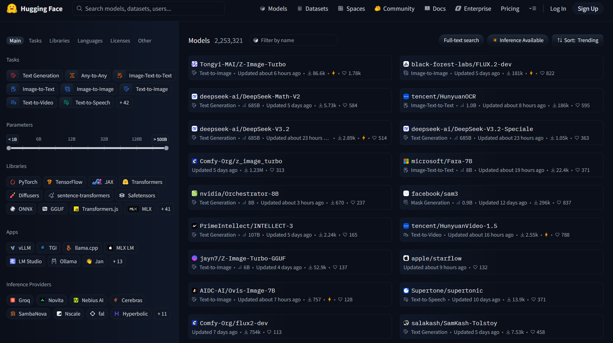
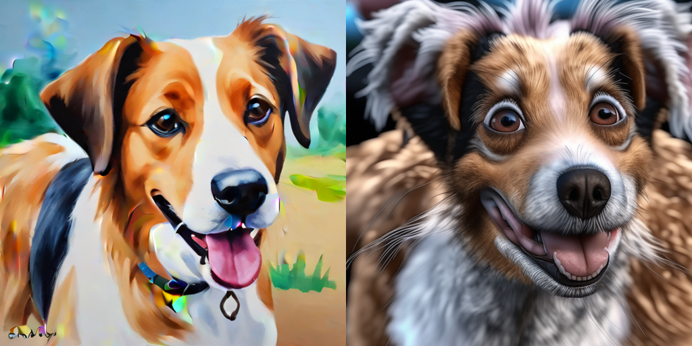
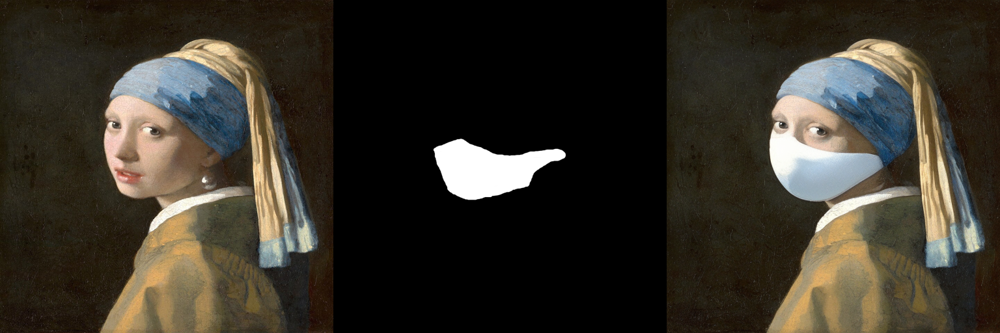
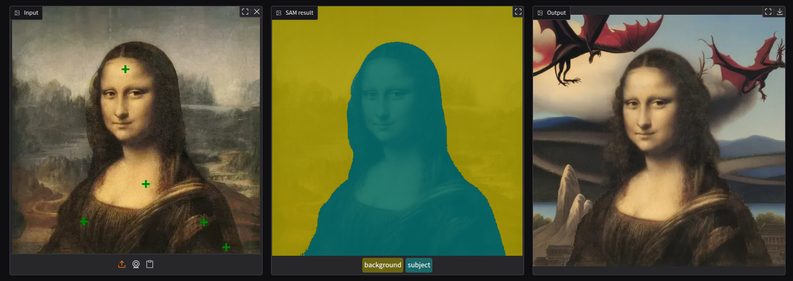

# Image Generation with Diffusion

<!--
# Log in/out to Docker Hub
docker logout
docker login

# Pull the official image (first time)
docker pull excalidraw/excalidraw

# Start app
docker run --rm -dit --name excalidraw -p 5000:80 excalidraw/excalidraw:latest
# Open browser at http://localhost:5000

# Stop
docker stop excalidraw
docker rm excalidraw
docker ps

-->

<div style="height: 20px;"></div>
<div align="center" style="border: 1px solid #e4f312ff; background-color: #fcd361b9; padding: 1em; border-radius: 6px;">
<strong>
This is the second post of a series of two.
You can find the <a href="https://mikelsagardia.io/posts/">first part here</a>.
Also, you can find the accompanying code in <a href="https://github.com/mxagar/diffusion-examples/diffusers">this GitHub repository</a>.
</strong>
</div>
<div style="height: 30px;"></div>


Blog Post 1  
Title: An Intorduction to Image Generation with Diffusers (1/2)  
Subtitle: A Conceptual Guide for Developers

Blog Post 2  
Title: An Intorduction to Image Generation with Diffusers (2/2)  
Subtitle: Hands-On Examples with Hugging Face

<p align="center">

<small style="color:grey">An AI drawing an AI drawing an AI... Image generated using 
<a href="https://openai.com/index/dall-e-3/">Dall-E v3</a>. Prompt: <i>A friendly humanoid robot sits at a wooden table in a bright, sunlit room, happily drawing on a sketchbook. Soft light colors, landscape, peaceful, productive, and joyful atmosphere. The robot is drawing an image of itself drawing, creating a recursive effect. Large window in the background with greenery outside, warm natural lighting.</i>
</small>
</p>

In very few years, image generation has become an almost ubiquitous tool. [Variational Autoencoders (VAEs - )](#) were followed by [Generative Adversarial Networks (GANs - )](#), and finally [Denoising Diffusion Probabilistic Models (DDPMs - Ho et al., 2020)]([#](https://arxiv.org/abs/2006.11239)) conquered the landscape, with remarkable models like [Stable Diffusion XL (Podell et al., 2023)]([#](https://arxiv.org/pdf/2307.01952)). In the [first post of this series](#) I explain how each of these models works and I provide an example implementation of a DDPM, which is trained to run car image generation, producing these examples:

<p align="center">

<small style="color:grey">
Output of a <a href="https://arxiv.org/abs/2006.11239">Denoising Diffusion Probabilistic Model (Ho et al., 2020)</a> consisting of 54 million paramaters, trained on the <a href="https://www.kaggle.com/datasets/eduardo4jesus/stanford-cars-dataset">Stanford Cars Dataset</a> (16,185 color images resized to <code>64x64</code> pixels) for 300 epochs. Check the complete implementation <a href="https://github.com/mxagar/diffusion-examples/tree/main/ddpm">here</a>.
</small>
</p>

In this second part, I would like to focus on **the practical application** of the diffusers, in particular, using the invaluable tools provided by [HuggingFace](https://huggingface.co/). To that end, I hava devided the post in three parts:

1. First, I provide a brief [Introduction to HuggingFace](#introduction-to-huggingface);
2. Then, I deep-dive into some examples with [HuggingFace Diffusers](#huggingface-diffusers);
3. And finally, I show how to build an [In-Painting Application](#in-painting-application) using the aforementioned tools.

Let's go!

## A Very Brief Introduction to HuggingFace

[HuggingFace](https://huggingface.co) has become one of the most important portals in the machine learning community. It builds a collaborative environment where state-of-the-art **datasets** and **models** can be **shared** and **tried** (*Spaces*). Moreover, HuggingFace offers two additional and very powerful sets tools:

- [**courses**](https://huggingface.co/learn) which deal with the most important domains and technical methods: computer vision, natural language processing, audio, agents, 3D processing, reinforcement learning, etc.;
- and **libraries** with which we can handle both datasets and models end-to-end and for any relevant modality. The most important ones are:
    - [`datasets`](https://huggingface.co/docs/datasets/en/index): conceived to access and share audio, text, and image data.
    - [`transformers`](https://huggingface.co/docs/transformers/en/index): for model training and inference, supporting text, computer vision, audio, video, and multimodal data.
    - [`diffusers`](https://huggingface.co/docs/diffusers/en/index): pretrained diffusion models for generating videos, images, and audio.

We can easily install those libraries in our Python environment with

```bash
pip install datasets transformers diffusers["torch"] accelerate gradio
```

<p align="center">

<small style="color:grey">
Screeshot of the <a href="https://huggingface.co">HuggingFace</a> portal, featuring available models sorted by their popularity.
</small>
</p>

*Discriminative* models of any modality as well as *generative* models specifically for text are handled usually by the `transformers` library. On the other hand, generative *diffusion* models are managed by `diffusers`. Browsing and selecting a model can be done on the web interface, whe we are able to filte them by several features, being probably one of the most important ones the [task](https://huggingface.co/docs/transformers/main/main_classes/pipelines#transformers.pipeline.task):

- `sentiment-analysis`
- `text-generation`
- `summarization`
- `translation`
- `audio-classification`
- `image-to-text`
- `object-detection`
- `image-segmentation`
- ...

If we click on a model we will land on its page, where we will see a model card reporting metrics, references and often a short code snippet to download the model and set it up and running.

The easiest way of running an inference call with any model is via the `pipeline` interface. Even though each task and model have their particularities, there is a common pattern that is repeated; let's take as example the task `text-generation`:

```python
import transformers

# Load the pipeline
pipe = transformers.pipeline(
    "text-generation",  # task
    model="Organization/ConcreteModel",  # change to real model, e.g.: "openai-community/gpt2"
)

# Define the input (prompt)
messages = [
    {"role": "system", "content": "You are an AI who can draw AIs."},
    {"role": "user", "content": "What's the best technique to draw an AI?"},
]

# Generate output (text)
outputs = pipe(
    messages,
)

# Display output (text)
print(outputs[0]["generated_text"][-1])
```

From the made-up example above, we can distill the common steps:

- First, a model pipeline is loaded, by defining the task family (e.g., `text-generation`) as well as the concrete model name (e.g., `openai-community/gpt2`) we want to use.
- Then, we need to define/instantiate the input to the pipeline; the input depends on the task at hand: if we want to classify an image, we need to load an image; if we want to generate text, we need an initial prompt of conversation history, etc.
- Finally, we pass the input to the pipeline and collect the outputs. Again, the type of output depends on the task at hand.

Instead of passing the model slug or name to the pipeline, we can explicitly load a particular type of model, say (the made-up) `ConcreteModel`, and similarly run inference with it. For instance, here's an example of how it usually is done for the task `text-to-image` using the `diffusers` library:

```python
from diffusers import ConcreteModel   # change to real model, e.g.: AutoPipelineForText2Image

# Load the pipeline
pipe = ConcreteModel.from_pretrained(
    "Organization/ConcreteModel",  # change to real model, e.g.: "stabilityai/sdxl-turbo"
    ...
)

# Define the input (prompt)
prompt = "An AI drawing an AI"

# Generate output (image)
image = pipe(
    prompt=prompt,
    ...
).images[0]

# Save output (image)
image.save("example.png")
```

All the above barely scratches the surface beneath the HuggingFace platform. In the following sections, I'll give practical examples that can be readily applied and which build up on the introduced concepts. However, if you would like to deepen on the capabilities of the `transformers` and `diffusers` liebraries, you can check the following resources:

- My [guide on HuggingFace](https://github.com/mxagar/tool_guides/tree/master/hugging_face), which covers, among others:
    - Combining models with Pytorch/Tensorflow code
    - More complex pre- and post processing steps for each task/modality, e.g.: tokenization, encoding, etc.
    - Fine-tuning pretrained models for different tasks adding cutom heads. 
    - Saving/loading fine-tuned models locally, as well as exporting them as ONNX for production.
    - Examples with genertive models of all modalities and conditioning types: `text-generation`, `text-to-image`, `text-to-video`, etc.
- A comprehensive example in which I [fine-tune a Large Language Model (LLM)](https://github.com/mxagar/llm_peft_fine_tuning_example) to perform a custom text classification task.
- My notes on the exceptional book [Natural Language Processing (NLP) with Transformers (Tunstall, von Werra & Wolf &mdash; O'Reilly)](https://github.com/mxagar/nlp_with_transformers_nbs), written by the co-founders of HuggingFace. The book is a must to fully understand and use the `transformers` library.

## HuggingFace Diffusers in Practice

Now let's run some examples with the `diffusers` library. For this section, I have prepared a notebook:

[`diffusers/diffusers_and_co.ipynb`](https://github.com/mxagar/diffusion-examples/blob/main/diffusers/diffusers_and_co.ipynb)

In the blog post, I will show and comment the results of running different models; for detailed (and commented) code snippets, please check the notebook.

Note that if want to run the notebook you will need a [GPU setup with at least 12 GB of VRAM](https://mikelsagardia.io/blog/mac-os-ubuntu-nvidia-egpu.html); alternatively, you could launch a [Google Colab instance](https://colab.research.google.com/) with a NVIDA T4, or similar.

The first notable example in the notebook deals with a *conditioned* image generation task, in particular `text-to-image` using the [Stable Diffusion XL Turbo](#) model. The code follows the pattern introduced in the previous section:

```python
from diffusers import AutoPipelineForText2Image

# Load the SDXL-Turbo text-to-image pipeline
pipe = AutoPipelineForText2Image.from_pretrained(
    "stabilityai/sdxl-turbo", 
    torch_dtype=torch.float16, 
    variant="fp16"
)

prompt = """
A friendly humanoid robot sits at a wooden table in a bright, sunlit room, happily drawing on a sketchbook.
Soft light colors, landscape, peaceful, productive, and joyful atmosphere.
The robot is drawing an image of itself drawing, creating a recursive effect.
Large window in the background with greenery outside, warm natural lighting.
"""

# Seed for reproducibility
rand_gen = torch.manual_seed(148607185)

# Generate an image based on the text prompt
image = pipe(
    prompt=prompt, 
    num_inference_steps=1, # 1 for sdxl-turbo, 25-50 for SD
    guidance_scale=1.0, # 1 for sdxl-turbo, 6-10 for SD
    negative_prompt=["overexposed", "underexposed"], 
    generator=rand_gen
).images[0]
```

The result is promising, but it clearly reveals that the image was generated by a model: we can see that unfinished or rare details appear in eyes and fingers, the mechanical structure of the robot with straight geometrical lines is not consistent or seems unrealistic, etc.

<p align="center">

<small style="color:grey">
Image generated with <a href="https://huggingface.co/stabilityai/sdxl-turbo">SDXL Tubo</a>.
Prompt: <i>A friendly humanoid robot sits at a wooden table in a bright, sunlit room, happily drawing on a sketchbook. Soft light colors, landscape, peaceful, productive, and joyful atmosphere. The robot is drawing an image of itself drawing, creating a recursive effect. Large window in the background with greenery outside, warm natural lighting.</i>
</small>
</p>

[Stable Diffusion XL Turbo](#) is a real-time text-to-image diffusion model derived from [Stable Diffusion XL (SDLXL)](#), designed to generate high-quality images in as few as one to four denoising steps. Unlike traditional diffusion models that require dozens of inference steps, SDXL Turbo prioritizes latency and interactivity while preserving much of SDXL's visual fidelity.

SDXL Turbo is trained using [Adversarial Diffusion Distillation (ADD)](#). Instead of sampling from the full diffusion process during inference, the model learns to directly approximate the output of a multi-step teacher model (SDXL) in very few steps:

- A large, high-quality SDXL model acts as a teacher.
- The Turbo model is trained to match the teacher's output distribution.
- An adversarial objective helps close the quality gap caused by aggressive step reduction.

In other words, a bigger model is distilled to a smaller one; that smaller model enables real-time generation in UIs and creative tools.

An alternative model to SDXL is [Playground V2](#), which also targets high-quality image generation with fewer inference steps; this model prioritizes visual quality and creative expressiveness, and doesn't follow any distillation during training.

<p align="center">

<small style="color:grey">
Model: <a href="https://huggingface.co/playgroundai/playground-v2-1024px-aesthetic">Playground V2</a>.
Same prompt ad before: <i>A friendly humanoid robot sits at a wooden table...</i>
</small>
</p>

Models can be used not only individually, but also in a concatenated chain. In the following example, I have let SDXL Turbo create an image of a puppy which is then used as condition for the `image-to-image` model [Kandinsky 2.2](https://huggingface.co/kandinsky-community/kandinsky-2-2-prior). The result is an exaggerated image of a dog, but I think it showcases the potential of building such chained pipelines.

<p align="center">

<small style="color:grey">
Left image generated by <a href="https://huggingface.co/stabilityai/sdxl-turbo">SDXL Tubo</a>.
Right image generated by <a href="https://huggingface.co/kandinsky-community/kandinsky-2-2-prior">Kandinsky Prior 2.2</a>.
Left prompt: <i>A painting of a friendly dog painted by a child.</i>
Right prompt: <i>A photo of a friendly dog. High details, realistic (negative: low quality, bad quality).</i>
</small>
</p>

Kandinsky is a multimodal diffusion model that separates semantic understanding from image generation. Unlike SDXL-style models, which directly condition image generation on text embeddings, Kandinsky uses a two-stage architecture:

- Prior model, which maps text (and optionally images) into a shared latent space that represents high-level semantics.
- Decoder model (diffusion), which takes these semantic embeddings and generates the final image via a diffusion process.

This explicit separation makes Kandinsky particularly well suited for compositional pipelines. One such pipeline consists in *in-painting*, i.e.: we ask the model to generate a sub-image on a provided initial image. Here's how it works:

- Mask definition: A binary mask specifies which regions of the image should be regenerated (white) and which should remain fixed (black).
- Latent conditioning: The unmasked parts of the image are encoded and injected into the diffusion process, anchoring the generation spatially.
- Semantic guidance via the prior: Text prompts and optional image context guide what should appear in the masked regions.
- Diffusion-based regeneration: Noise is added only in the masked area, and the model denoises it while respecting both the surrounding visual context and the semantic intent from the prompt.

Because Kandinsky reasons at a semantic level first, inpainting results tend to be context-aware: lighting, perspective, and style are usually consistent with the original image, even when the prompt introduces new elements.

Here is an example with the popular oil painting [*The Girl with the Pearl Ear-ring* from Vermeer](#). Unfortunately, the *pearl ear-ring* is removed!

<p align="center">

<small style="color:grey">
Model: <a href="https://huggingface.co/kandinsky-community/kandinsky-2-2-decoder-inpaint">Kandinsky Inpaint 2.2</a>.
Prompt: <i>Oil painting of a woman wearing a surgical mask, Vermeer (negative: bad anatomy, deformed, ugly, disfigured).</i>
I obtained the image from the Wikipedia and draw the mask manually.
Check <a href="#">this piece from Banksy</a>, if you would like to know how this could be done differently.
</small>
</p>

## Building Proof-of-Concept Applications: Zero-Shot Segmentation and In-Painting

As shown in the notebook [`diffusers/diffusers_and_co.ipynb`](https://github.com/mxagar/diffusion-examples/blob/main/diffusers/diffusers_and_co.ipynb), it is very simple to run different models for different isolated tasks. That brings us to the next logical question: *what if we combine different models to build small apps?*

Along this lines, I have implemented an [`inpainting_app`](https://github.com/mxagar/diffusion-examples/blob/main/diffusers), which works as follows:

- We can load an image, where we select points in a region we would like to segment: the foreground.
- Then, the [Segment Anything Model (SAM) from Meta](https://huggingface.co/docs/transformers/en/model_doc/sam) is used to create a mask of that region of interest; the complementary is the background. SAM is a vision transformer which is able to segment different parts of an image out-of-the-box. However, it requires some input points or a bounding box to specify which region to segment.
- Finally, we select either the foreground or the background region and run the in-painting version of [SDXL model](https://huggingface.co/diffusers/stable-diffusion-xl-1.0-inpainting-0.1); that way, the selected region is re-painted following the introduced prompt, but remaining consistent with the contents of the complementary region.

Note as beforehand, that if plan to run the app locally you will need a [GPU setup with at least 12 GB of VRAM](https://mikelsagardia.io/blog/mac-os-ubuntu-nvidia-egpu.html) :sweat_smile:.

That application makes use of [Gradio](https://www.gradio.app/), a python library similar to [Streamlit](https://streamlit.io/) which builds nice-looking, web-based GUIs. Gradio is developed by HuggingFace, making it the perfect choice for the models we are using. The library is really easy to use and I won't spend &mdash; if you are interested, you can check my [Gradio Quickstart Guide](https://github.com/mxagar/tool_guides/tree/master/gradio), which introduces all the necessary concepts and more.

The structure is quite simple:

- The GUI and the app structure are controlled by [`app.py`](https://github.com/mxagar/diffusion-examples/blob/main/inpainting_app/app.py). The entry point is `app.generate_app()`, which receives two functions:
    - The function that segments an image given some selection points.
    - The function which runs the inpainting of an image given a mask.
- The notebook [`inpainting.ipynb`](https://github.com/mxagar/diffusion-examples/blob/main/inpainting_app/inpainting.ipynb) defines and prepares those input functions:
    - `run_segmentation(raw_image, input_points, processor, model, ...) -> input_mask`
    - `run_inpainting(raw_image, input_mask, prompt, pipeline, ...) -> generated_image`
- Internally, `app.generate_app()` instantiates a `gradio.Blocks` object, which is composed by `gradio.Row()` sections that contain the UI widgets: image canvases, sliders, text boxes, buttons, etc. Those widgets are associated to callback functions that run the passed functions; for instance: when we select points in the uploaded `raw_image`, the callback `on_select()` is invoked, which under the hood executes `run_segmentation()` using the uploaded `raw_image` and the selected `input_points`.

Of course, we can pack everything into modules, but the notebook serves as a nice playground to test different functionalities and models interactively.

When we launch the application by invoking `app.generate_app()`, the user sees the following UI in `http://localhost:8080`:

...

So how does it perform? Let's see some examples!

<p align="center">

<small style="color:grey">
Monalisa re-imagined. <a href="https://huggingface.co/docs/transformers/en/model_doc/sam">SAM (Segment Anything Model)</a> is used to segment foreground (green) & background (yellow), and <a href="https://huggingface.co/diffusers/stable-diffusion-xl-1.0-inpainting-0.1
">Stable Diffusion XL Inpainting</a> to re-generate the selected region.
Prompt (applied to the background): <i>A fantasy landscape with flying dragons (negative: artifacts, low quality, distortion).</i>
</small>
</p>

Conclusions...

## Wrapping Up

:construction: TBD.
